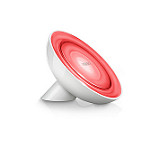
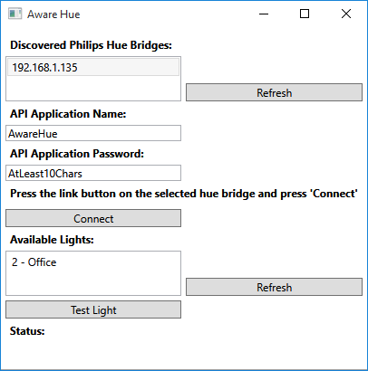

# Aware Hue
An Aware addon that shows your status using a Philips Hue lamp.

When you are working on things that you would like to do less off: it turns the configured light red. When you are in the zone, the light shines green.

# Using

To install download the latest installer from the [releases](https://github.com/BucklingSprings/AwareHue/releases) tab.

After the install, the configuration UI will show up automatically. This might take a minute or so (make sure that Aware is running).

To configure: Click on the refresh button next to the list of bridges, change the password, select the bridge you want and connect to it by pressing the link button on the bridge and then the connect button in the UI. All your Hue lights should now be listed in the available lights list. Select the light you would like to use as your Aware notification light. Clicking on the Test Light button should switch the selected light to flashing blue.

#License
The code is licensed under a 3-clause BSD license.

